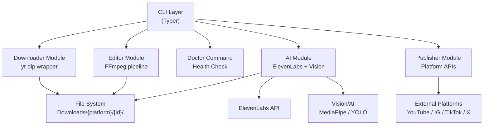

# Architecture

This document describes the high-level architecture of VideoCut-CLI.

## 1. Layer Overview



## 2. Directory Structure

```text
videocut-cli/
├── videocut/
│   ├── __init__.py
│   ├── cli.py               # Entry point, all command groups
│   ├── config.py            # Global configuration & paths
│   │
│   ├── modules/
│   │   ├── downloader.py    # yt-dlp wrapper (Android player bypass)
│   │   ├── editor.py        # FFmpeg pipeline (watermark)
│   │   ├── ai_crop.py       # (Soon) Re-frame 16:9 → 9:16
│   │   ├── ai_highlights.py # (Soon) Auto-highlights from transcript
│   │   ├── ai_dub.py        # (Soon) ElevenLabs dubbing/subbing
│   │   └── publisher.py     # (Soon) Upload to social media platforms
│   │
│   ├── presets/             # (Soon) YAML presets
│   │
│   └── utils/               # Shared utilities
│
├── tests/
├── pyproject.toml
└── README.md
```

## 3. Technical Stack
- **Language**: Python 3.9+
- **CLI Framework**: Typer (Type-safe Click-based)
- **Downloader**: yt-dlp
- **Video Engine**: FFmpeg (via subprocess for maximum flexibility)
- **AI Integration (Soon)**: ElevenLabs, Whisper, YOLO/MediaPipe
