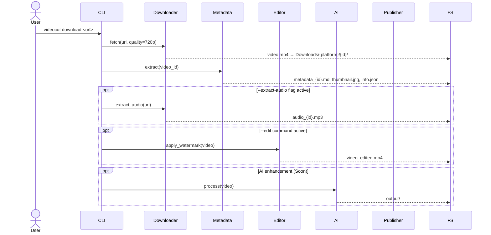

# Data Workflow

This document explains how data flows through VideoCut-CLI and how output is organized.

## 1. Sequence Diagram



## 2. Output Directory Structure

Files are organized by platform and video ID for easy management.

```text
~/Downloads/
└── {platform}/                     # e.g., youtube, instagram
    └── {video_id}/                 # e.g., ZDKJnLmEt0I
        ├── {slug}_{id}_{res}.mp4   # Original video (with resolution in name)
        ├── metadata_{id}.md        # Cleaned markdown metadata
        ├── {slug}_{id}_{res}.jpg   # Video thumbnail
        ├── {slug}_{id}_{res}.json  # Full raw yt-dlp metadata
        ├── {slug}_{id}_{res}.vtt   # Subtitles (if available)
        ├── {slug}_{id}_audio.mp3   # Audio extract (if requested)
        └── output/                 # (Soon) Result folder for editing/AI
```

## 3. Smart Skip Logic
VideoCut-CLI checks if the target files already exist in the `{video_id}` folder before starting a download. If found, it skips the redundant processing to save bandwidth and time.
