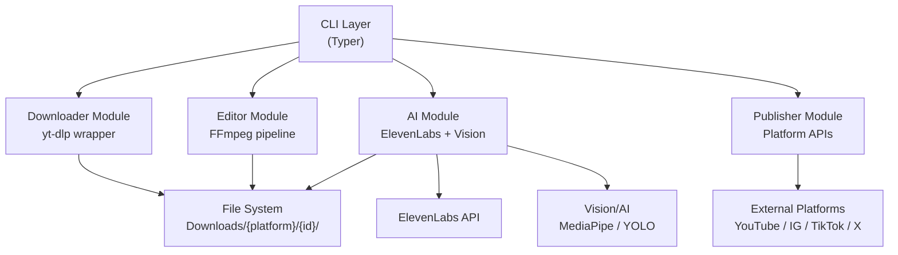

# VideoCut-CLI — Blueprint & Arsitektur

> **Tool**: `videocut` | **Stack**: Python 3.9+, FFmpeg, yt-dlp, ElevenLabs API  
> **Target User**: Content creator yang butuh pipeline download → edit → publish yang otomatis.

---

## ⚡ Recent Changes (Changelog)
- **v0.2.0**:
    - Implementasi dynamic filename: `{slug}_{id}_{resolution}.mp4`.
    - Menambahkan mode `--metadata-only` dan `--extract-audio` (MP3).
    - Menambahkan sistem **Cookie Persistence**: menyimpan cookies di `~/.videocut/stored_cookies.txt` dan auto-reuse.
    - Implementasi **Smart Skip**: otomatis melewati download jika file (video/audio/metadata) sudah ada.
    - Menghilangkan noise output CLI (deprecation & SABR warnings).
    - Memperbaiki penamaan metadata menjadi `metadata_{id}.md`.

---

## 1. Arsitektur Aplikasi
...

### Layer Overview



### Struktur Direktori Proyek

```
videocut-cli/
├── videocut/
│   ├── __init__.py
│   ├── cli.py               # Entry point, semua command groups
│   ├── config.py            # Konfigurasi global & paths
│   │
│   ├── modules/
│   │   ├── downloader.py    # yt-dlp wrapper (Android player bypass)
│   │   ├── editor.py        # FFmpeg pipeline (watermark)
│   │   ├── ai_crop.py       # (Planned) Re-frame 16:9 → 9:16
│   │   └── publisher.py     # (Planned) Upload ke platform medsos
│   │
│   ├── presets/             # (Planned) YAML presets
│   │
│   └── utils/               # Shared utilities
│
├── tests/
├── pyproject.toml
└── README.md
```

---

## 2. Alur Kerja Data (Data Workflow)

### Struktur Output Direktori

```
~/Downloads/
└── {platform}/
    └── {video_id}/                  # misal: ZDKJnLmEt0I
        ├── video_720p.mp4           # Video asli (kualitas di nama file)
        ├── metadata.md              # Judul, uploader, deskripsi
        ├── video_720p.jpg           # Thumbnail asli
        ├── video_720p.info.json     # Full metadata dari yt-dlp
        ├── video_720p.en.vtt        # Subtitle format VTT
        └── output/                  # (Planned) Hasil olahan
```

---

## 3. Struktur Perintah CLI

### 3.1 `videocut download`

```bash
videocut download <URL> [OPTIONS]

Options:
  -q, --quality [360|480|720|1080|best]  Kualitas (default: 720)
  -o, --output  PATH                     Custom output directory
  --no-thumb                             Skip thumbnail
  --no-transcript                        Skip transcript
  --cookies-browser BROWSER              Extract cookies from browser
  --cookies PATH                         Path ke cookies.txt
```

---

### 3.2 `videocut edit`

```bash
videocut edit <VIDEO_ID|PATH> [OPTIONS]

Options:
  -p, --preset  [base|reels|shorts|custom]  Preset editing (default: base)
  --trim        START:END                    Trim manual (format: 00:01:30:00:02:45)
  --caption                                  Auto-generate subtitle dari transkrip
  --caption-style [minimal|bold|tiktok]      Gaya subtitle
  --watermark   TEXT                         Teks watermark
  --watermark-pos [tl|tr|bl|br|center]       Posisi watermark (default: br)
  --bgm         PATH                         Path file audio BGM
  --bgm-vol     FLOAT                        Volume BGM 0.0-1.0 (default: 0.15)
  --output      PATH                         Path output custom

Examples:
  videocut edit dQw4w9WgXcQ --preset reels --caption --watermark "@Pena Digital"
  videocut edit ./video.mp4 --trim 00:00:30:00:01:45 --bgm ./bgm.mp3
```

---

### 3.3 `videocut ai`

```bash
videocut ai <SUBCOMMAND>

Subcommands:
  crop          Re-frame landscape ke portrait 9:16 via AI object detection
  highlights    Potong video panjang jadi beberapa clip highlight
  dub           Auto-dubbing/subbing via ElevenLabs
  thumbnail     Generate thumbnail dengan overlay teks

# crop
videocut ai crop <VIDEO_ID|PATH> [OPTIONS]
  --subject [person|product|auto]  Target deteksi (default: auto)
  --padding FLOAT                  Padding sekitar subjek 0.0-0.5 (default: 0.1)

# highlights
videocut ai highlights <VIDEO_ID|PATH> [OPTIONS]
  --max-clips INT                  Jumlah clip max (default: 5)
  --min-duration INT               Durasi min clip dalam detik (default: 20)
  --max-duration INT               Durasi max clip dalam detik (default: 60)
  --lang  [id|en|auto]             Bahasa transkrip untuk analisis (default: auto)

# dub
videocut ai dub <VIDEO_ID|PATH> [OPTIONS]
  --target-lang [id|en|de|fr|...]  Bahasa target dubbing (required)
  --voice-id    TEXT               ElevenLabs Voice ID (gunakan config jika tidak diisi)
  --mode [dub|sub|both]            Mode output (default: both)

# thumbnail
videocut ai thumbnail <VIDEO_ID|PATH> [OPTIONS]
  --text    TEXT                   Teks overlay utama (required)
  --subtext TEXT                   Teks sekunder
  --style   [bold|gradient|clean]  Gaya desain (default: bold)
  --output  PATH                   Path output thumbnail

Examples:
  videocut ai crop dQw4w9WgXcQ --subject person
  videocut ai highlights dQw4w9WgXcQ --max-clips 3 --max-duration 45
  videocut ai dub dQw4w9WgXcQ --target-lang id --mode both
  videocut ai thumbnail dQw4w9WgXcQ --text "5 Tips Produktivitas" --style gradient
```

---

### 3.4 `videocut publish`

```bash
videocut publish <VIDEO_PATH> [OPTIONS]

Options:
  --platform [youtube|ig|tiktok|x]  Platform tujuan (required)
  --title   TEXT                    Judul video
  --desc    TEXT                    Deskripsi video
  --tags    TEXT                    Tags (pisah koma)
  --schedule DATETIME               Jadwal publish (format: YYYY-MM-DD HH:MM)
  --draft                           Upload sebagai draft, tidak publish

Examples:
  videocut publish ./output/edited_9x16.mp4 --platform tiktok --title "Tips Produktivitas"
  videocut publish ./output/edited.mp4 --platform youtube --schedule "2026-05-01 09:00" --draft
```

---

### 3.5 `videocut config`

```bash
videocut config [OPTIONS]

Options:
  --set KEY VALUE   Set nilai konfigurasi
  --get KEY         Tampilkan nilai konfigurasi
  --list            Tampilkan semua konfigurasi
  --reset           Reset ke default

Config Keys:
  elevenlabs.api_key      API Key ElevenLabs
  elevenlabs.voice_id     Default Voice ID untuk dubbing
  output.base_dir         Base direktori output (default: ~/Downloads)
  ffmpeg.path             Path custom ke binary FFmpeg
  youtube.api_key         YouTube Data API v3 Key
  tiktok.client_key       TikTok for Developers Client Key

Examples:
  videocut config --set elevenlabs.api_key YOUR_KEY_HERE
  videocut config --list
```

---

### 3.6 `videocut batch`

```bash
videocut batch <FILE.txt> [OPTIONS]

# FILE.txt berisi daftar URL, satu per baris

Options:
  --preset [base|reels|shorts]  Preset untuk semua video dalam batch
  --workers INT                 Jumlah download paralel (default: 2)
  --skip-existing               Skip jika video_id sudah ada di output dir
  --edit                        Auto-edit setelah download
  --crop                        Auto-crop ke 9:16 setelah edit

Examples:
  videocut batch urls.txt --preset reels --workers 3 --edit --crop
```

---

## 4. Preset Schema (YAML)

```yaml
# presets/reels.yaml
name: "Instagram Reels / TikTok"
aspect_ratio: "9:16"
resolution: "1080x1920"
max_duration: 90          # detik
trim:
  enabled: false
caption:
  enabled: true
  style: "tiktok"         # bold teks bawah, background semi-transparan
  font: "Montserrat-Bold"
  font_size: 52
  color: "#FFFFFF"
  stroke_color: "#000000"
  stroke_width: 3
watermark:
  enabled: true
  text: ""                # diisi via --watermark flag
  position: "br"
  opacity: 0.8
bgm:
  enabled: false
  volume: 0.15
crop:
  auto: true
  subject: "auto"
```

---

## 5. Roadmap Pengembangan

### Phase 1 — MVP (1-2 Bulan)

> **Goal**: Tool bisa digunakan harian untuk download + edit dasar.

| # | Fitur | Detail |
|---|-------|--------|
| 1.1 | `download` command | yt-dlp wrapper, support YouTube (Shorts + Long) |
| 1.2 | Auto-directory | Struktur `Downloads/youtube/{id}/` dengan metadata.md & thumbnail |
| 1.3 | Transkrip | Extract subtitle dari yt-dlp (`.srt`/`.vtt`) atau Whisper local |
| 1.4 | `edit` command | Preset base: trim manual, watermark teks, BGM sederhana |
| 1.5 | Auto-caption | Burn subtitle `.srt` ke video via FFmpeg |
| 1.6 | `config` command | Simpan API keys & preferensi di `~/.videocut/config.yaml` |
| 1.7 | Packaging | Install via `pip install videocut` atau `pipx install videocut` |

**Stack MVP**: Python, Click/Typer, yt-dlp, FFmpeg, Whisper (local, opsional)

---

### Phase 2 — AI Core (2-3 Bulan)

> **Goal**: AI enhancement aktif dan bisa menghasilkan konten Reels/Shorts siap publish.

| # | Fitur | Detail |
|---|-------|--------|
| 2.1 | `ai crop` | Re-frame 16:9 → 9:16 via MediaPipe face detection atau YOLO |
| 2.2 | `ai highlights` | Analisis transcript (keyword/energy scoring) → potong clip terbaik |
| 2.3 | `ai dub` | Integrasi ElevenLabs API untuk dubbing & generate subtitle target |
| 2.4 | `ai thumbnail` | PIL/Pillow overlay teks dinamis di atas thumbnail download |
| 2.5 | Preset `reels` & `shorts` | Full pipeline: crop → caption → watermark dalam 1 command |
| 2.6 | `batch` command | Proses daftar URL dari file `.txt` secara paralel |

**Tambahan Stack**: ElevenLabs SDK, MediaPipe / Ultralytics (YOLO), Pillow, OpenAI Whisper

---

### Phase 3 — Publisher & Integrasi (2-3 Bulan)

> **Goal**: Pipeline download → edit → publish fully otomatis.

| # | Fitur | Detail |
|---|-------|--------|
| 3.1 | `publish youtube` | Upload via YouTube Data API v3 (judul, desc, thumbnail, jadwal) |
| 3.2 | `publish tiktok` | Upload via TikTok for Developers API |
| 3.3 | `publish ig` | Upload Reels via Instagram Graph API |
| 3.4 | `publish x` | Upload via X (Twitter) Media API |
| 3.5 | IG/TikTok Download | Perluas `download` command untuk IG & TikTok URL |
| 3.6 | `--schedule` flag | Queue publish dengan waktu terjadwal (via APScheduler) |

---

### Phase 4 — Final & Polish (Ongoing)

> **Goal**: Produk matang, bisa digunakan tim content creator secara kolaboratif.

| # | Fitur | Detail |
|---|-------|--------|
| 4.1 | Plugin system | Pengguna bisa tambah custom preset & processor |
| 4.2 | TUI Dashboard | Rich-based interactive dashboard untuk melihat status job & queue |
| 4.3 | Project mode | `videocut init project` untuk kelola multi-video dalam 1 proyek |
| 4.4 | AI Smart Trim | Deteksi silence/low-energy segments untuk auto-remove |
| 4.5 | Face blur | Otomatis blur wajah non-utama untuk privasi |
| 4.6 | Analytics pull | Tarik statistik video dari YouTube/IG API pasca-publish |
| 4.7 | n8n Webhook | Trigger workflow otomatis ke n8n setelah publish selesai |

---

## 6. Keputusan Teknis Utama

| Keputusan | Pilihan | Alasan |
|-----------|---------|--------|
| Bahasa | Python | Ekosistem AI/ML terbaik, paket yt-dlp & ffmpeg-python tersedia |
| CLI Framework | [Typer](https://typer.tiangolo.com/) | Type-safe, auto-completion, berbasis Click |
| FFmpeg wrapper | `subprocess` langsung | Lebih fleksibel dari ffmpeg-python untuk pipeline kompleks |
| AI Crop | MediaPipe (Phase 2) → YOLO v8 (Phase 3) | MediaPipe ringan untuk MVP, YOLO lebih akurat untuk produk |
| Transkrip | yt-dlp subtitle → fallback Whisper local | Hemat waktu jika subtitle tersedia, akurat untuk video tanpa CC |
| Config storage | `~/.videocut/config.yaml` | Standard untuk CLI tools, mudah di-edit manual |
| Packaging | `pipx` / `pip` via `pyproject.toml` | Modern Python packaging standard |

---

## 7. Quick Start (Target)

```bash
# Install
pipx install videocut

# Setup API keys
videocut config --set elevenlabs.api_key YOUR_KEY

# Download + auto-edit untuk Reels dalam 1 command
videocut download https://youtu.be/dQw4w9WgXcQ --preset reels --crop --publish ig

# Batch processing
videocut batch urls.txt --preset shorts --workers 3 --edit
```
